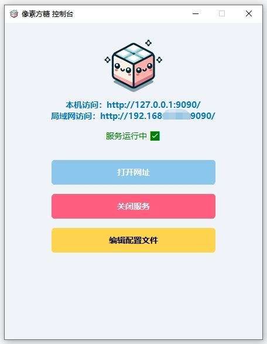
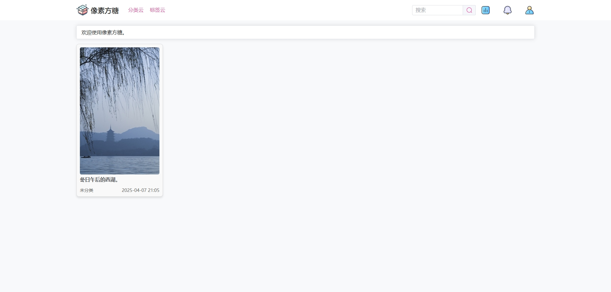
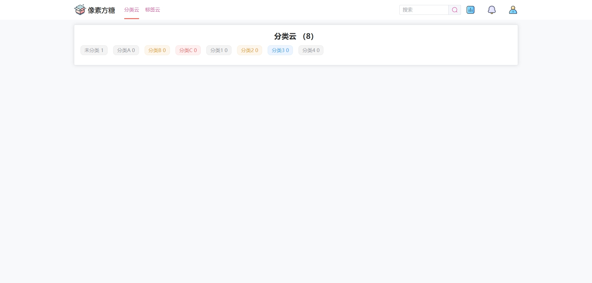

# 像素方糖 PixelCube

还在为没有合适的工具管理硬盘里的学习资料而发愁吗？  
那么这个小工具，也许正是你需要的。

**像素方糖**是一款专注于图集整理与私密资源管理的本地应用，目标是帮助你轻松、有序地归档学习资料。本地运行，无需联网，安全高效。

如果你在使用过程中有任何建议，比如希望加入某些功能，欢迎通过 issue 与我交流。  
我会认真评估每一个想法，并在更新日志中致谢有贡献的建议。

## 🧭 使用方式

1. 前往 [Releases](https://github.com/OOOBT/PixelCube/releases) 页面，下载最新版压缩包  
2. 解压后双击运行程序（首次启动将自动生成配置文件）  
3. 配置数据库连接信息（支持 MySQL）  
4. 启动服务，访问页面即可使用系统  

### 🔐 初始账号信息

首次运行时系统会自动创建一个管理员账号，请尽快前往仪表盘修改邮箱和密码：

- **邮箱**：`admin@qq.com`  
- **密码**：`admin`  

## 🖼️ 界面展示
### 🖥️ 控制台界面

### 🏠 系统首页

### 📄 文章详细内容页

### 🧩 分类云视图

## 🚧 开发计划

- 🕸 **网站资源爬虫**  

- 🕰 **浏览记录与收藏功能**

- 📦 **高级导出与打包归档**

- 🧩 **插件系统**

## 📄 许可证 License

本软件为专有授权产品，仅限个人本地使用。使用过程中请遵守以下条款：

- 禁止修改、反编译或逆向工程；
- 禁止再分发、改名或另行打包；
- 未经授权不得用于任何商业用途。

详见 [`LICENSE.txt`](./LICENSE.txt)

## 📬 联系作者

- GitHub：[@OOOBT](https://github.com/OOOBT)
